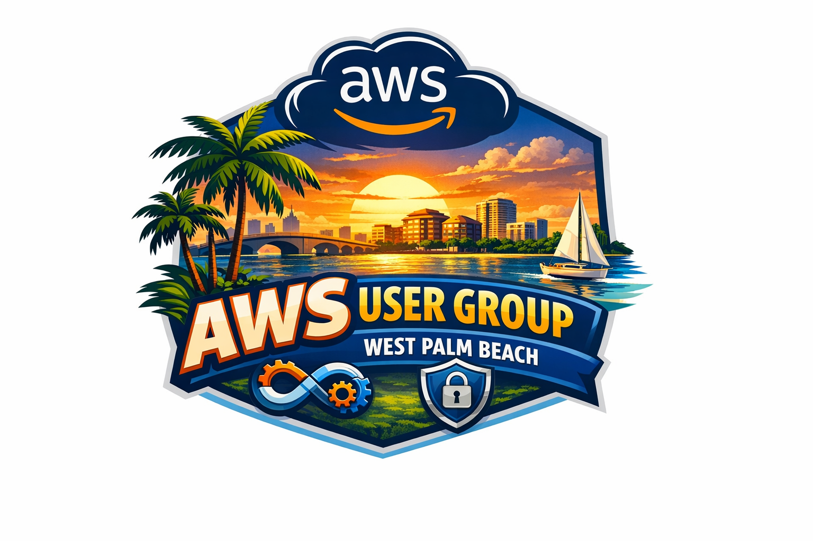

# AWS User Group West Palm Beach



This repository is a beginner-friendly learning hub for the AWS User Group West Palm Beach.

It is designed for community members who are new to:

- version control with Git
- GitHub pull requests
- CI basics
- AWS hands-on practice

## Quick Start

1. Read [Getting Started](docs/GETTING-STARTED.md).
2. Complete [Git and GitHub Primer](docs/GIT-GITHUB-PRIMER.md).
3. Review [AWS Prerequisites](docs/AWS-PREREQUISITES.md).
4. Start your first lab: [Lab 01 - AWS CLI Basics](labs/lab-01-aws-cli-basics/README.md).

## Repository Layout

- `docs/`: onboarding guides and references
- `events/`: meetup-specific agendas and links
- `labs/`: short guided exercises
- `projects/`: longer guided builds
- `sample-code/`: examples used by labs/projects
- `templates/`: reusable templates for contributors
- `.github/`: workflows and issue/PR templates

## Licenses

- Code: [Apache-2.0](LICENSE)
- Docs/slides: [CC-BY-4.0](LICENSE-DOCS)

## Logo and Images

Store README and docs images in [assets/images](assets/images/README.md).

For the group logo, place the file in:

- `assets/images/branding/aws_user_group_west_palm_beach_logo.png`

Then reference it in this README with:

```md

```

## Contributing

See [CONTRIBUTING.md](CONTRIBUTING.md).

## Maintainers

See [docs/MAINTAINER-GUIDE.md](docs/MAINTAINER-GUIDE.md) for branch protection and triage guidance.
